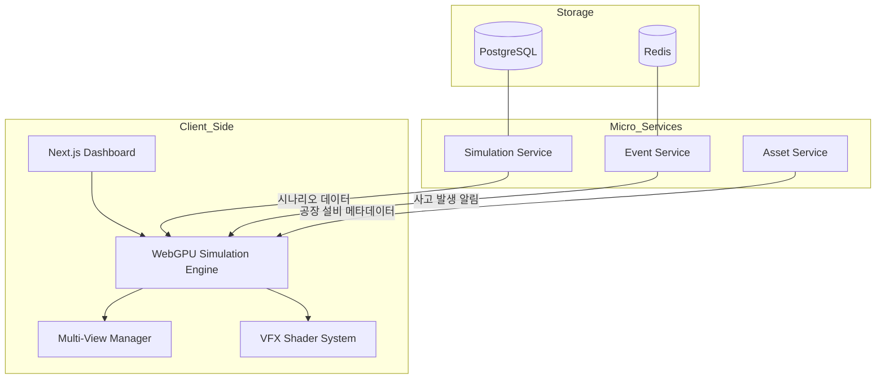

# [PRD] V-Factory: 고성능 가상 공장 안전 모니터링 시뮬레이션

## 1. 프로젝트 개요 (Project Overview)

**V-Factory**는 WebGPU 기반의 3D 렌더링 기술을 활용하여 대규모 공장 환경을 가상화하고, 컨베이어 벨트와 다수의 CCTV를 통해 산업 현장의 안전 사고 시나리오를 시각화하는 시뮬레이터입니다. 특히 사고 발생 시 시각적 이펙트와 멀티뷰 시스템을 통해 관리자가 즉각적으로 현장을 파악하는 **'관제 경험의 고도화'**에 집중합니다.

---

## 2. 사용자별 사용 시나리오 (User Scenarios)

* **공장 안전 관리자:** 대시보드에서 2x2 또는 3x3 CCTV 멀티뷰를 통해 공장 전체를 모니터링합니다.
* **사고 대응 요원:** 특정 구역에서 사고(컨베이어 끼임, 전도 등)가 발생하면 즉시 붉은색 글리치 이펙트가 발생하는 해당 CCTV 뷰를 클릭하여 상세 상황을 파악합니다.
* **시스템 시뮬레이션 설계자:** 컨베이어 벨트의 속도와 근로자(NPC)의 동선을 조정하며 사고 발생 확률이 높은 사각지대를 시뮬레이션으로 검증합니다.

---

## 3. 고객이 얻을 수 있는 핵심가치 (Key Value)

* **실시간 가시성:** WebGPU를 이용해 수십 개의 CCTV 피드를 지연 없이 한 화면에서 렌더링하여 공장 전체의 가시성을 확보합니다.
* **위험 인지 극대화:** 사고 발생 시 강렬한 시각적 이펙트(빨간색 외곽선, 노이즈 등)를 통해 관리자의 인지 속도를 높입니다.
* **안전 교육 데이터:** 실제 사고 없이도 가상 환경에서 다양한 사고 시나리오를 생성하고 이를 데이터화하여 안전 매뉴얼 구축에 활용합니다.

---

## 4. 핵심 기능 (Core Features)

### 4.1 가상 공장 환경 (Environment)

* **Conveyor System:** 애니메이션 루프가 아닌 WebGPU Compute Shader를 이용한 물리 기반 컨베이어 벨트 구동.
* **Worker NPCs:** 공장 내부를 이동하며 정해진 업무를 수행하는 다수의 캐릭터.
* **Static CCTV Deployment:** 공장 주요 지점에 고정식 CCTV 배치 (PTZ 기능 제거, 광각 렌더링 집중).

### 4.2 사고 시뮬레이션 및 이펙트 (Accident Logic & VFX)

* **Accident Trigger:** 확률적 또는 수동으로 사고(NPC 쓰러짐, 장비 충돌)를 발생시키는 로직.
* **CCTV Alert Effect:** 사고가 포착된 카메라 뷰에 **Red Overlay, Glitch, Scanline** 이펙트 적용.
* **Victim Highlight:** 사고를 당한 NPC 캐릭터에 **Red Outlining** 및 **Pulse Effect**를 적용하여 즉시 식별 가능하게 구현.

### 4.3 UI/UX (Multi-View Dashboard)

* **Grid View:** ShadCN 기반의 가변 그리드 시스템 (최대 960x540 해상도의 멀티 피드 지원).
* **Incident Log:** 사고 발생 시점, 위치, 관련 CCTV 번호를 실시간 리스트로 출력.

---

## 5. 기술 스택 (Tech Stack)

| 구분 | 기술 스택 | 비고 |
| --- | --- | --- |
| **Frontend** | Next.js 14 (App Router), Vue.js | UI 인터페이스 및 대시보드 구성 |
| **3D Engine** | Three.js (WebGPU Renderer) | 고성능 공장 렌더링 |
| **Styling** | ShadCN, TailwindCSS | 반응형 관제 레이아웃 |
| **Shader** | WGSL (WebGPU Shading Language) | 컨베이어 벨트 물리 및 사고 이펙트 처리 |
| **Backend** | FastAPI | 사고 로그 기록 및 시나리오 관리 API |
| **Architecture** | MSA (Micro Services) | 렌더링/이벤트/자산 서비스 분리 |

---

## 6. MSA 기반 시스템 구조 (Architecture)

---

## 7. MVP 개발 이후 추가 개선사항 (Post-MVP)

* **Replay System:** 사고 발생 전후 30초간의 시뮬레이션 데이터를 저장하여 재시청 기능 제공.
* **Heatmap Visualization:** 사고가 자주 발생하는 구역을 히트맵으로 시각화하여 설비 재배치 제안.
* **IoT Data Integration:** 실제 공장 센서 데이터를 연동하여 가상 환경과 동기화(Digital Twin).

---

## 💡 전문가의 설계 조언

1. **CCTV 멀티뷰 최적화:** 다수의 카메라 뷰를 렌더링할 때, 각 뷰마다 독립적인 `render pass`를 생성해야 합니다. WebGPU의 `CommandEncoder`를 효율적으로 사용하여 드로우 콜(Draw Call)을 최적화하는 것이 관건입니다.

2. **사고 이펙트 구현:** 사고 발생 시 해당 CCTV 텍스처에 포스트 프로세싱(Post-processing) 셰이더를 입혀야 합니다. WGSL에서 `textureSample`을 활용해 실시간으로 노이즈 필터를 적용하면 매우 실감 나는 사고 알림을 구현할 수 있습니다.

3. **컨베이어 벨트 로직:** 벨트 위의 물체 이동은 물리 엔진보다는 수학적인 공식을 Compute Shader에서 처리하여 수천 개의 부품이 이동해도 프레임 드랍이 없도록 설계하겠습니다.
